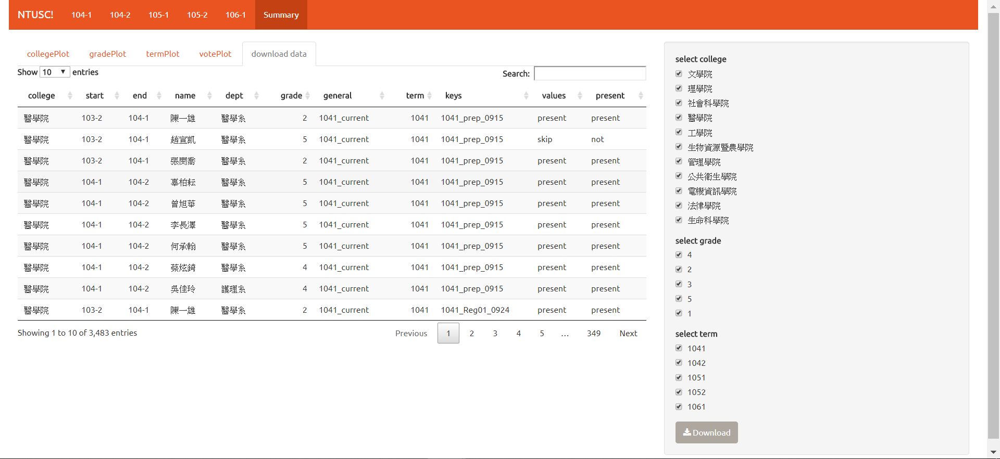

```{r setup, include=FALSE}
knitr::opts_chunk$set(echo = TRUE)
```

### **Brief Introduction**

在完成前述步驟後，最後的工作就是如何將成果傳達(communicate)給大眾了。考慮到易用性與互動性，最後我選擇做出一個以`shiny`做出的互動式 app 而不只是固定的 html檔案，希望可以增加使用者的自由度。這個 NTUSC app 主要有兩個部分，一部分是**各學期資料與視覺化**，另一部分則是**整體資料統整**。

就各學期資與視覺化而言，依據前面視覺化頁面所呈現，共有四個部分，依序是是依照特定欄位(院別、系別、年級別、全體學代)進行統整的整學期出席比例資料、依照特定欄位(院別、系別、年級別、全體學代)進行統整的各次會議出席率資料、有時間性的各次會議出席/未請假缺席/請假缺席統整資料、所有資料的表格。

就整體資料統整而言，依據前面視覺化頁面所呈現，共有五個部分，依序是是五個學期的院別出席率資料、五個學期的年級出席率別資料、五個學期的各自會議出席率資料、統整的投票率相關資料、依照特定欄位(院別、系別、年級別、全體學代)進行篩選的資料表格與資料下載。

### **Each Term Data & Visualization**
 

 

### **Overall Data Summary & Download**
 

 