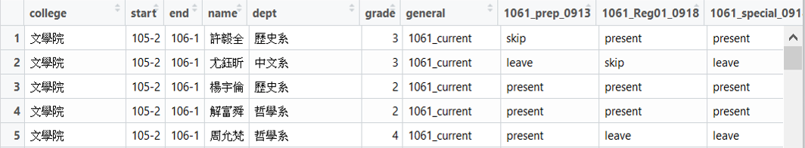

```{r setup, include=FALSE}
knitr::opts_chunk$set(echo = TRUE)
```

### **Data Importing & Tidying - NTUSC Attendance Data**

台大學代出席資料的原始檔案放在 google spreadsheet上，下載下來為 excel 的 xlsx 格式，因為有些期數的資料缺失，因此我到 PTT NTUSC 版上尋找學代會議的紀錄，再依照出缺席名單比對後抄寫至 excle 中。我先在 excel 當中依照後續分析與呈現的需要進行簡單的資料處理，如判斷學代是否有出席、將欄位改成英文名稱、取捨變數等等(判斷出席與缺席時間 missing value 過多且用處不大故捨棄)，完成後另存為 csv 丟進 R 裡面繼續處理。

 

丟進 R 之後使用 R 的函數進行整理，和 excel 的最大差別是能夠利用程式的特性減少重複的工作。最後將其整理成下方的data frame。 

 

上方的資料框原本是寬表格(wide)，因為分析需要，使用`tidyr`將其轉換成長表格。


### **Data Importing & Tidying - NTUSC Vote Data**

台大學代投票資料的原始檔案格式為 PDF，雖然可以使用 word 開啟，但因為原始表格的設計，所以有些資料無法複製貼上，需要手動輸入，更有甚者，104-1的選舉公報完全缺失，所以要去 PTT NTU 版上的貼文抄寫，非常麻煩，在此花上不少時間。

 

 

如上圖所見，資料主要有兩個部分，其一是每位候選人的得票資料，其二為每個學院的得票資料。將其整理在 excel 當中後，我將資料轉存成 csv，在R當中讀取後進行整合。

 

 

我使用`dplyr`當中的合併相關函數(`left_join`)，將兩筆資料整合在一起。下圖是資料joining後的結果。


### **Data Transforming**

接下來透過`dplyr`, `stringr`, `forcats`等`tidyverse`大家庭下的套件，使用`mutate`, `group_by`, `counte`,`summarise`,`if_else`等函數將上述兩以資料清理乾淨，並且也對資料進行簡單的敘述性統計觀察，以利後續的分析。
